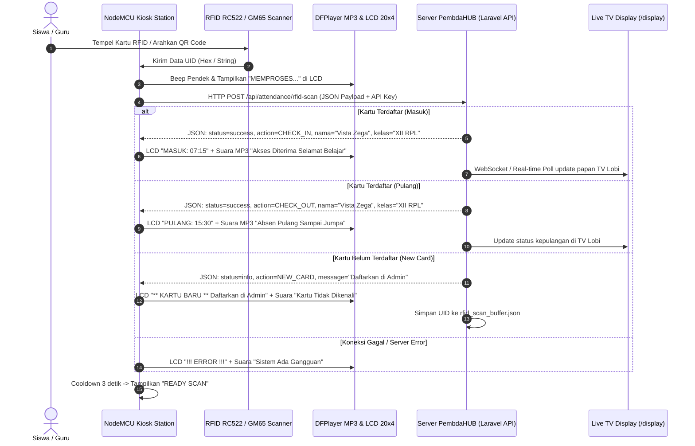

# BAB 1: PENJELASAN CARA KERJA, FUNGSI & TEKNOLOGI

---

## 1.1 Gambaran Umum (Overview)
**Kiosk Attendance Station PembdaHUB** adalah perangkat *IoT Edge Terminal* mandiri berbasis mikrokontroler **NodeMCU V3 (ESP8266 ESP-12F)** yang dirancang untuk merekam kehadiran siswa, guru, staf, dan pegawai secara terpusat, cepat, dan *real-time*.

Perangkat ini menggabungkan dua metode identifikasi (*Dual-Input Identification*):
1. **Kartu Pintar Nirkabel (RFID Mifare 13.56 MHz)**
2. **Optik Barcode / QR Code (Modul GM65 Serial)**

Sistem dilengkapi dengan antarmuka pengguna interaktif berupa **Layar LCD 20x4 I2C**, **Indikator Buzzer Dinamis**, dan **Sapaan Suara Interaktif (DFPlayer Mini MP3 + Speaker)** yang memberikan respon suara ramah seperti *"Selamat Pagi, Silakan Belajar"*, *"Selamat Bertugas"*, *"Absen Pulang, Sampai Jumpa"*, atau *"Kartu Belum Terdaftar"*.

---

## 1.2 Fungsi Utama Sistem
1. **Pencatatan Kehadiran Otomatis (Masuk & Pulang):**
   * *Tap* pertama pada hari tersebut otomatis dicatat sebagai **Jam Masuk** (`CHECK_IN`).
   * *Tap* kedua setelah jam sekolah/kerja dicatat sebagai **Jam Pulang** (`CHECK_OUT`).
2. **Dukungan Multi-Entitas Terpadu (Single Station for All):**
   * Otomatis membedakan siswa (SMP, SMA, SMK), Guru, Staf Tata Usaha / Yayasan, serta Karyawan Unit Usaha TEFA.
3. **Mekanisme Anti Double-Tap / Cooldown (Anti-Spamming):**
   * Mencegah siswa/guru men-tap kartu berulang kali dalam interval 3 detik.
4. **Registrasi Kartu Otomatis (*Instant Scan-Buffer*):**
   * Kartu baru yang belum terdaftar di database akan diterima dan UID-nya disimpan di server sementara (*scan buffer*).
   * Operator/Admin cukup membuka halaman Web Admin PembdaHUB, dan kolom UID RFID pada form registrasi siswa/guru akan terisi otomatis tanpa perlu mengetik manual.
5. **Konektivitas Tangguh dengan Multi-AP Failover:**
   * NodeMCU otomatis berpindah ke SSID WiFi cadangan (Hotspot HP / Router Backup) apabila jaringan WiFi utama terputus tanpa perlu restart manual.

---

## 1.3 Diagram Alur Cara Kerja (System Architecture & Flow)

---

## 1.4 Teknologi & Protokol yang Digunakan

### 1. Mikrokontroler: NodeMCU ESP-12F (ESP8266)
* **Arsitektur:** Tensilica Xtensa 32-bit L106 RISC Microprocessor.
* **Clock Speed:** 80 MHz / 160 MHz (Overclockable untuk akselerasi enkripsi TLS).
* **Flash Memory:** 4 MegaByte (SPI Flash).
* **Fitur Utama:** Built-in WiFi 802.11 b/g/n, TCP/IP stack terintegrasi, dan konsumsi daya rendah.

### 2. Protokol Komunikasi Sensor & Periferal
* **SPI (Serial Peripheral Interface):** Digunakan untuk komunikasi berkecepatan tinggi dengan modul **RFID RC522** (Clock 1 MHz untuk stabilitas clone chip).
* **I2C (Inter-Integrated Circuit):** Digunakan untuk modul **LCD 20x4 PCF8574** (Hanya membutuhkan 2 jalur data: `SDA` di GPIO4 dan `SCL` di GPIO5).
* **UART / SoftwareSerial:** Digunakan untuk komunikasi dua arah:
  * RX SoftwareSerial menerima frame data dari **GM65 QR Scanner** pada 9600 bps.
  * TX SoftwareSerial mengirim instruksi paket heksadesimal ke **DFPlayer Mini MP3**.

### 3. Keamanan & Komunikasi Jaringan (Cloud / Server)
* **TLS / SSL (BearSSL Engine):** Komunikasi terenkripsi `HTTPS (Port 443)` ke endpoint API server `https://perguruanpembda.com`.
* **RESTful JSON API:** Pengiriman data payload ringan berbasis format JSON (`{"uid":"...", "type":"rfid", "device_id":"STATION-01"}`).
* **X-Kiosk-API-Key:** Header otentikasi unik untuk mencegah akses tidak sah ke endpoint absensi.
* **Scan-Buffer Endpoint (`/api/rfid/scan-buffer`):** Penampung memori sementara (*in-memory buffer*) untuk mempercepat pairing kartu siswa baru secara nirkabel.
